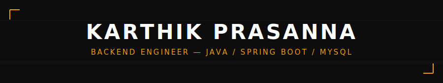
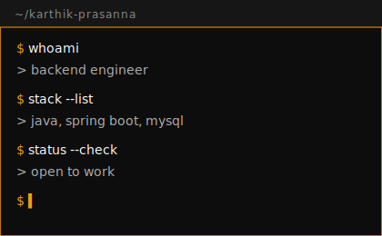

<div align="center">



<br/>


</div>

<br/>

---

## `// 01 — PROFILE`

<table>
<tr>
<td width="60%" valign="top">

```java
final class KarthikPrasanna {

    String role        = "Backend Engineer";
    String[] core      = { "Java", "Spring Boot", "MySQL" };
    String mission      = "Build clean, scalable, production-grade systems";
    String currentFocus = "High-integrity REST APIs + resilient data design";

    void philosophy() {
        System.out.println("Maintainability > cleverness.");
    }
}
```

**What I bring to a team**

`01` Scalable, deliberate backend architecture
`02` REST APIs with clear, predictable contracts
`03` MySQL schema and query design built for scale
`04` Code written to be read — by others, and by future me

</td>
<td width="40%" align="center">



</td>
</tr>
</table>

---

## `// 02 — STACK`

<div align="center">

<table>
<tr>
<td align="center" width="100">

<br><sub><b>JAVA</b></sub>
</td>
<td align="center" width="100">

<br><sub><b>SPRING</b></sub>
</td>
<td align="center" width="100">

<br><sub><b>MYSQL</b></sub>
</td>
<td align="center" width="100">

<br><sub><b>GIT</b></sub>
</td>
<td align="center" width="100">

<br><sub><b>POSTMAN</b></sub>
</td>
<td align="center" width="100">

<br><sub><b>INTELLIJ</b></sub>
</td>
</tr>
</table>

```text
CORE     :: Java · Spring Boot · MySQL
WORKFLOW :: Git · Postman · IntelliJ IDEA
```

</div>

---

## `// 03 — ANALYTICS`

<div align="center">


<br/><br/>


<br/><br/>


</div>

---

## `// 04 — ENGINEERING PRINCIPLES`

```text
01. Write for maintainability first, optimize second.
02. Build APIs with clear contracts and predictable behavior.
03. Keep business logic modular, testable, and readable.
04. Design databases for integrity, scale, and performance.
```

---

## `// 05 — DIRECTION`

<div align="center">

<br/>
<br/>


</div>

---

## `// 06 — CONNECT`

<div align="center">

[](https://linkedin.com/in/karthik-prasanna7)
[](https://github.com/karthikprasanna07)
[](mailto:pkarthikprasanna7@gmail.com)

<br/>

**`OPEN TO BACKEND ENGINEER OPPORTUNITIES`**
`JAVA · SPRING BOOT · REST APIs · MYSQL`

</div>
